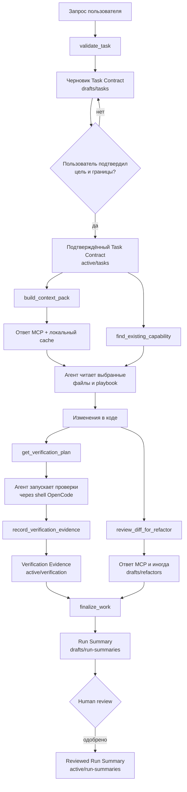

# Процесс работы Project Context Router и его артефакты

Эта инструкция описывает не установку, а жизненный цикл задачи: что происходит
от первого запроса до завершения работы, какие файлы и ответы появляются на
каждом этапе и какой контекст получает агент перед изменением кода.

Подключение к OpenCode описано отдельно в
[`docs/install/opencode.ru.md`](install/opencode.ru.md).

## Коротко: весь процесс



Главный принцип: сначала появляется подтверждённый контракт задачи, затем агент
получает ограниченный и объяснимый набор контекста, после реализации сохраняются
факты проверки и черновик итогового отчёта.

## Четыре типа артефактов

Важно различать файлы, ответы MCP и кэши:

| Тип | Где находится | Попадает в Git | Назначение |
| --- | --- | --- | --- |
| Активная долговечная память | `.project-context/active/**/*.md` | Обычно да | Task Contract, решения, backlog, verification evidence и другие рабочие записи |
| Черновики | `.project-context/drafts/**/*.md` | Нет, каталог добавляется в `.gitignore` | Предложения, которым ещё нужен human review |
| Пересоздаваемые данные | `.project-context/indexes/` | Нет | SQLite-индекс и кэш context pack; не являются источником истины |
| Ответы MCP | Контекст текущей сессии OpenCode | Нет | Структурированные результаты `validate_task`, `build_context_pack`, reuse scan и других вызовов |

Каталог `.project-context/trash/` также игнорируется Git. Туда перемещаются
заменённые или уже подтверждённые версии черновиков, чтобы операция оставалась
восстановимой и проверяемой локально.

Большинство предложений попадает в `active/` только после human review.
Исключение — `record_verification_evidence`: в текущей реализации фактическая
запись о проверках создаётся сразу в `active/verification/`.

## Артефакты по этапам

| Этап | Ответ агенту | Изменение на диске |
| --- | --- | --- |
| Инициализация | Список созданных и пропущенных путей | `project.yaml`, README, шаблоны, правила `.gitignore` |
| Индексация | Количество records, symbols, endpoints и найденные проблемы | `indexes/context.sqlite` |
| `validate_task` | Статус, workflow, suggested contract, вопросы, assumptions, related records | `drafts/tasks/TASK-....md` |
| `confirm_task_contract` | Статус и путь активного контракта | `active/tasks/TASK-....md`; прежний draft перемещается в `trash/` |
| `start-work` | Статус и путь | В существующем Task Contract обновляется статус |
| `build_context_pack` | Records, files, excerpts, playbooks, commands, warnings и budget | `indexes/pack-cache/<key>.json`; индекс может автоматически обновиться |
| `find_existing_capability` | Кандидаты на переиспользование и рекомендация | Ничего |
| Реализация | Обычные ответы агента и terminal output | Git diff, исходные файлы и тесты проекта |
| `get_verification_plan` | Required/optional checks, старые evidence и warnings | Ничего |
| `record_verification_evidence` | ID, статус и путь записи | `active/verification/VERIFY-....md` |
| `review_diff_for_refactor` | Кандидаты, риск, `doNow`, файлы | Иногда `drafts/refactors/REFACTOR-....md` |
| `finalize_work` | Статус, путь и признак необходимости review | `drafts/run-summaries/....md` |
| `promote_draft` | Preview или результат promotion | Reviewed-запись в `active/`; исходный draft перемещается в `trash/` |

## Этап 0. Инициализация проекта

Команда:

```bash
npx project-context init --name "My Project" --module backend:src
```

создаёт основу процесса:

| Артефакт | Что внутри |
| --- | --- |
| `.project-context/project.yaml` | Имя и назначение проекта, модули, aliases, `source_globs`, playbook-файлы, команды проверки и настройки retention |
| `.project-context/README.md` | Краткие правила хранения проектной памяти |
| `.project-context/templates/TASK-CONTRACT.md` | Короткий шаблон контракта для локальных низкорисковых задач |
| `.project-context/templates/TASK-CONTRACT.full.md` | Расширенный шаблон для API, данных, security, migration и кросс-модульных изменений |
| `.project-context/templates/VERIFICATION-RECORD.md` | Шаблон фактического отчёта о выполненных и пропущенных проверках |
| `.gitignore` | Исключения для `drafts/`, `indexes/` и `trash/` |

После команды:

```bash
npx project-context index
```

появляется `.project-context/indexes/context.sqlite`. В нём хранятся
пересоздаваемые поисковые данные:

- метаданные контекстных записей, их теги, модули и ссылки на файлы;
- текст записей для ранжированного поиска;
- найденные в исходном коде symbols/capabilities и их сигнатуры;
- найденные endpoints;
- fingerprints, по которым определяется свежесть индекса.

Markdown/YAML и исходный код остаются источниками истины. SQLite можно удалить и
построить заново.

## Этап 1. Приём и валидация задачи

Агент вызывает:

```text
validate_task({ query: "Добавить экспорт CSV", mode: "feature" })
```

### Что возвращается агенту

Ответ MCP содержит:

- `status`: `READY`, `NEEDS_CLARIFICATION`, `TOO_BROAD` и другие результаты;
- `taskDraftId`;
- рекомендуемый workflow: `fast`, `standard` или `strict`;
- `suggestedContract` с целью, scope, out-of-scope, критериями приёмки, рисками,
  проверками, модулями и тегами;
- `blockingQuestions`;
- сделанные системой предположения в `inferred`;
- похожие существующие задачи или решения в `relatedRecords`;
- подсказки по дальнейшему workflow.

`suggestedContract` пока является только ответом MCP. Он не считается
подтверждённым решением пользователя.

### Какой файл создаётся

Одновременно создаётся:

```text
.project-context/drafts/tasks/TASK-YYYYMMDD-HHMMSS-001.md
```

Упрощённый пример:

```markdown
---
id: TASK-YYYYMMDD-HHMMSS-001
type: task
status: validating
title: Добавить экспорт CSV
confirmed_by_human: false
source:
  kind: user_prompt
modules:
  - backend
files: []
tags:
  - exports
retention: normal
---

# TASK-...: Добавить экспорт CSV

## Goal

Добавить экспорт CSV.

## Scope

To be confirmed.

## Acceptance Criteria

To be confirmed.

## Open Questions

- Какие поля должны попадать в экспорт?

## Inferred

- Задача затрагивает модуль backend.
```

Если есть блокирующие вопросы, статус файла будет `clarification_required`.
Этот черновик фиксирует исходный запрос и вопросы, но не разрешает начинать
реализацию.

## Этап 2. Human review и подтверждение Task Contract

Пользователь проверяет предложенные границы. После явного подтверждения агент
вызывает `confirm_task_contract` и передаёт согласованные значения:

```text
confirm_task_contract({
  taskId,
  goal,
  scope,
  outOfScope,
  acceptanceCriteria,
  risks,
  testExpectations,
  modules,
  files,
  tags
})
```

### Что меняется на диске

```text
.project-context/drafts/tasks/TASK-....md
        │
        ├──> .project-context/active/tasks/TASK-....md
        └──> .project-context/trash/TASK-....draft.md
```

В `active/tasks` записывается уже полный согласованный контракт со статусом
`confirmed`, отметкой `confirmed_by_human: true` и временем подтверждения.

Внутри него находятся:

- цель;
- что входит и не входит в работу;
- проверяемые критерии приёмки;
- риски;
- ожидаемые команды проверки;
- модули и при необходимости конкретные файлы;
- связи с bugs, decisions и refactors.

Это первый долговечный артефакт конкретной задачи и главная граница для агента.
Подтверждение само по себе не строит context pack: это отдельный следующий вызов.

Для API, схемы данных, авторизации, миграций или нескольких модулей следует
дополнительно сверяться с расширенным шаблоном
`.project-context/templates/TASK-CONTRACT.full.md`. Он предлагает явно описать
API, storage, security, public workflow, rollout, rollback и защищаемое поведение.

### Необязательная отметка начала работы

CLI-команда:

```bash
npx project-context start-work TASK-YYYYMMDD-HHMMSS-001
```

меняет в том же активном контракте `status: confirmed` на
`status: in_progress`. Новый файл не создаётся. В текущем `core` MCP-профиле
отдельного инструмента `start_work` нет, поэтому в OpenCode этот шаг при
необходимости выполняется через terminal/shell.

## Этап 3. Построение context pack

Перед реализацией агент вызывает пакет с идентификатором подтверждённой задачи:

```text
build_context_pack({
  query: "Добавить экспорт CSV",
  taskId: "TASK-YYYYMMDD-HHMMSS-001",
  workflow: "standard",
  explain: true
})
```

Передавать `taskId` важно: тогда подтверждённый Task Contract гарантированно
включается в пакет как явная запись, а его `modules` и `files` участвуют в
маршрутизации.

### Как собирается пакет

Router последовательно:

1. Проверяет свежесть SQLite-индекса и при необходимости перестраивает его.
2. Определяет модули по запросу, `taskId`, явным и изменённым файлам.
3. Добавляет сам Task Contract и указанные в нём файлы.
4. Ищет подходящие активные записи: решения, backlog, patterns, runbooks и другие
   типы проектной памяти.
5. Ищет подходящие symbols/capabilities в исходном коде по `source_globs` из
   `project.yaml`.
6. Выбирает обязательные и условные playbook-файлы по модулю и triggers.
7. Подбирает команды проверки, настроенные для затронутых модулей.
8. Очищает выдержки от значений, похожих на секреты.
9. Укладывает результат в token budget, при необходимости сокращая менее важные
   данные и добавляя предупреждение о truncation.

### Что находится в ответе `build_context_pack`

Упрощённая структура:

```json
{
  "summary": "Context pack for ...",
  "profile": "default",
  "workflow": "standard",
  "maxTokens": 10000,
  "records": [
    {
      "id": "TASK-...",
      "path": ".project-context/active/tasks/TASK-....md",
      "reason": "Explicit task id.",
      "excerpt": "Короткая релевантная выдержка..."
    }
  ],
  "files": [
    {
      "path": "src/export/csv.ts",
      "reason": "Matched function exportCsv...",
      "excerpt": "Короткая очищенная выдержка из файла..."
    }
  ],
  "playbooks": ["AGENTS.md", "playbooks/testing.md"],
  "playbookDetails": [
    {
      "path": "AGENTS.md",
      "reason": "Configured module playbook...",
      "estimatedTokens": 420,
      "required": true
    }
  ],
  "commands": ["npm test"],
  "warnings": [],
  "budget": {
    "limit": 10000,
    "estimatedTokens": 2500,
    "truncated": false,
    "droppedRecords": 0,
    "droppedFiles": 0,
    "droppedPlaybooks": 0
  },
  "cache": {
    "status": "miss",
    "path": ".project-context/indexes/pack-cache/<key>.json"
  }
}
```

### Размер пакета по workflow

| Workflow | Максимум записей | Максимум файлов | Типичный сценарий |
| --- | ---: | ---: | --- |
| `fast` | 5 | 6 | Документация, текст, форматирование, небольшая локальная конфигурация |
| `standard` | 10 | 14 | Обычная задача внутри одного модуля |
| `strict` | 12 | 18 | API, DB, auth, security, persistence или кросс-модульная работа |

Для стандартного профиля token budget по умолчанию равен 10 000, для `strict` —
16 000. Профиль `local-model` использует 4 000 токенов и по умолчанию выбирает
`fast`.

### Какой файл появляется

Ответ кэшируется в:

```text
.project-context/indexes/pack-cache/<24-символьный-key>.json
```

Кэш содержит версию формата, fingerprint входных данных и сам пакет. Он
автоматически перестаёт использоваться после изменения релевантных active-записей,
`project.yaml`, playbooks, спецификации, явных файлов или индекса. Это ускорение,
а не документ проекта; срок хранения по умолчанию задаётся retention-настройкой.

## Что именно получает агент перед реализацией

После корректного прохождения предыдущих этапов у агента есть:

1. Подтверждённый Task Contract — цель, scope, out-of-scope, критерии приёмки,
   риски и проверки.
2. Определённые модули и конкретные файлы, если они были указаны или найдены.
3. Релевантные active-записи с путями, причинами выбора и короткими выдержками.
4. Релевантные исходные файлы или symbols с путями, причинами и выдержками.
5. Список обязательных/условных playbook-файлов и оценку их размера.
6. Точные команды проверки из `project.yaml`.
7. Предупреждения: отсутствующие playbooks, небезопасные пути, отсутствующий
   индекс или сокращение пакета из-за token budget.
8. Отдельный результат reuse scan с найденными компонентами и рекомендацией:
   переиспользовать напрямую, скопировать локальный pattern или сначала
   согласовать широкий refactor. Текущий классификатор выдаёт
   `direct_reuse`, `copy_local_pattern` и `ask_before_broad_refactor`.

При необходимости вызовы `get_project_brief` и `get_project_snapshot` также дают
агенту общую конфигурацию проекта, modules, source-of-truth routes, состояние
`doctor`, backlog и краткий dirty-worktree summary.

### Чего агент не получает автоматически

- весь репозиторий целиком;
- полное содержимое каждого файла из `files`;
- полное содержимое playbook-файлов — в pack находятся их пути и метаданные;
- несвязанные черновики;
- архивные записи без `includeArchive: true`;
- завершённые задачи, старые run summaries, verification evidence и refactor
  history без `includeHistory: true`;
- результаты ещё не выполненных тестов;
- автоматическое разрешение менять код за пределами подтверждённого scope.

Поэтому начало реализации выглядит так:

```text
Task Contract подтверждён
        ↓
агент получает context pack и reuse scan
        ↓
агент читает полные версии обязательных playbooks,
Task Contract и действительно нужных файлов
        ↓
агент формирует локальный план и только затем меняет код
```

Context pack — это маршрутизатор и компактное основание для решения, а не замена
чтению исходного кода.

## Этап 4. Поиск переиспользования

Вызов:

```text
find_existing_capability({
  query: "CSV export",
  modules: ["backend"]
})
```

возвращает найденные функции, классы, DTO, endpoints, helpers или patterns:

```json
{
  "matches": [
    {
      "path": "src/export/existing-exporter.ts",
      "kind": "function",
      "name": "exportReport",
      "classification": "direct_reuse",
      "reason": "..."
    }
  ],
  "recommendation": "..."
}
```

Отдельный файл не создаётся. Результат остаётся в контексте текущей сессии и
должен повлиять на план реализации до появления нового reusable-кода.

## Этап 5. Реализация

Агент читает выбранные файлы, вносит изменения в обычный working tree и следует
Task Contract. Сам OpenCode MCP-конфиг не устанавливает lifecycle hooks, поэтому
во время редактирования Project Context Router не создаёт скрытых постоянных
записей автоматически.

Артефакты этого этапа — обычный Git diff и новые/изменённые файлы проекта.
Черновик решения можно создать отдельно через `record_decision`, если в ходе
реализации принято долговечное архитектурное решение; он попадёт в
`.project-context/drafts/decisions/` и потребует human review. Этот MCP-инструмент
относится к профилю `admin`; при `core` та же операция доступна через CLI.

## Этап 6. План проверки

После реализации агент вызывает:

```text
get_verification_plan({ id: "TASK-YYYYMMDD-HHMMSS-001" })
```

Ответ содержит:

- target и путь к Task Contract;
- затронутые modules;
- `required` checks с причиной и источником требования;
- `optional` checks;
- уже записанные evidence для этой задачи;
- warnings;
- краткую сводку количества проверок.

План проверки — ответ MCP, а не файл. Сам MCP-сервер не выполняет shell-команды.
Агент запускает их обычным terminal-инструментом OpenCode и собирает фактические
exit codes и результаты.

## Этап 7. Verification Evidence

После выполнения команд агент вызывает `record_verification_evidence`:

```text
record_verification_evidence({
  targetId: "TASK-YYYYMMDD-HHMMSS-001",
  targetType: "task",
  summary: "Проверки завершены",
  checks: [
    { command: "npm test", status: "passed", durationMs: 4200 },
    {
      command: "manual browser smoke",
      status: "skipped",
      reason: "В задаче нет UI-изменений"
    }
  ],
  changedFiles: ["src/export/csv.ts"],
  recordedBy: "agent"
})
```

Создаётся долговечная запись:

```text
.project-context/active/verification/VERIFY-YYYYMMDD-HHMMSS-001.md
```

В YAML frontmatter находятся связь с задачей, aggregate status, автор записи,
modules, changed files и структурированный массив checks. В Markdown-теле
дублируются читаемые человеком summary, проверки, статусы, длительности, причины
пропуска и изменённые файлы.

Verification Evidence сразу записывается в `active/`, а не в `drafts/`, потому
что фиксирует наблюдаемые факты запуска. Статус вычисляется так:

- `failed`, если упала хотя бы одна проверка;
- `skipped`, если все проверки пропущены или не запускались;
- `passed`, если есть успешно пройденная проверка и нет failed;
- `recorded`, если список пуст.

## Этап 8. Refactor review

Вызов:

```text
review_diff_for_refactor({ taskId: "TASK-..." })
```

анализирует текущий Git diff и возвращает candidates с:

- названием;
- риском `low`, `medium` или `high`;
- признаком `doNow`;
- причиной;
- затронутыми файлами.

Если изменено несколько файлов одного модуля, может появиться рекомендация на
локальное низкорисковое улучшение без отдельного файла. Если diff пересекает
несколько модулей и передан `taskId`, дополнительно создаётся:

```text
.project-context/drafts/refactors/REFACTOR-YYYYMMDD-HHMMSS-001.md
```

В нём фиксируются проблема, evidence в виде файлов, предлагаемое изменение,
риск, исходная задача и правило не выполнять широкий refactor без отдельного
подтверждения.

## Этап 9. Финализация работы

Агент передаёт в `finalize_work` только факты:

```text
finalize_work({
  taskId: "TASK-...",
  summary: "Добавлен экспорт CSV",
  changedFiles: ["src/export/csv.ts"],
  tests: [{ command: "npm test", status: "passed" }],
  skippedChecks: [],
  decisions: [],
  result: "implemented"
})
```

Создаётся или обновляется черновик:

```text
.project-context/drafts/run-summaries/YYYYMMDD-HHMMSS-001.md
```

Внутри находятся:

- `source_task` и текущий `source_commit`;
- modules и changed files;
- итоговое summary и `result`;
- выполненные тесты со статусами;
- пропущенные проверки с обязательными причинами;
- решения, принятые по ходу работы;
- явная пометка о необходимости human review.

Повторная финализация той же задачи на том же commit обновляет существующий
черновик, а не создаёт дубликат. Если нет связанного подтверждённого Task
Contract, `finalize_work` возвращает `SKIPPED` и не создаёт сиротский run summary.

После ревью черновик можно предварительно просмотреть и затем продвинуть в
активную память через `promote_draft`. Применение требует имени одобрившего:

```bash
npx project-context promote-draft RUN-YYYYMMDD-HHMMSS-001
npx project-context promote-draft RUN-YYYYMMDD-HHMMSS-001 \
  --apply --approved-by "Reviewer Name"
```

После применения появляется `.project-context/active/run-summaries/RUN-....md`
со статусом `reviewed`, а исходный draft перемещается в `trash/`. Инструмент
`promote_draft` доступен в MCP-профиле `admin`; при профиле `core` используйте
CLI или временно переключите профиль после осознанного решения.

`finalize_work` не переводит сам Task Contract в `done`: он создаёт итоговый
черновик. Это отдельное состояние, которое текущая реализация не изменяет
автоматически.

## Если задача пришла из backlog

Дополнительная ветка выглядит так:

```text
drafts/backlog/BACKLOG-....md
        ↓ human confirm
active/backlog/BACKLOG-....md
        ↓ task_from_backlog
active/tasks/TASK-....md
        ↓ implementation + evidence
transition_backlog_item(status="done", evidenceId="VERIFY-...")
```

Backlog-запись содержит priority, размер для агента, modules, source references,
dependencies, files, acceptance criteria и checks. `pick_next_task` выбирает
только `ready/open` запись без нерешённых зависимостей. `task_from_backlog`
переносит данные backlog в Task Contract и сохраняет обратную ссылку на источник.

Перевод backlog в `done` блокируется, если не передан `evidenceId` и для записи
нет сохранённого verification evidence.

## Как выглядит каталог после завершённой задачи

```text
.project-context/
├── project.yaml
├── active/
│   ├── tasks/
│   │   └── TASK-....md              # подтверждённая граница задачи
│   ├── verification/
│   │   └── VERIFY-....md            # факты выполненных проверок
│   ├── decisions/
│   │   └── DECISION-....md          # только после отдельного ревью/продвижения
│   └── run-summaries/
│       └── RUN-....md               # только если summary был одобрен
├── drafts/
│   ├── refactors/
│   │   └── REFACTOR-....md          # отложенное предложение
│   └── run-summaries/
│       └── ....md                    # итог ещё ожидает ревью
├── indexes/
│   ├── context.sqlite               # пересоздаваемый поиск
│   └── pack-cache/
│       └── <key>.json                # кэш ответа context pack
└── trash/
    └── TASK-....draft.md             # предыдущая версия подтверждённого draft
```

Не каждый файл появляется в каждой задаче. Минимальный нормальный след —
подтверждённый Task Contract, изменения кода, Verification Evidence и черновик
Run Summary.

## Рекомендуемый промпт для OpenCode

```text
Используй MCP-сервер project_context.

1. Проверь мой запрос через validate_task и покажи suggested Task Contract,
   inferred assumptions, related records и blocking questions. Не меняй код.
2. Дождись моего явного подтверждения цели, scope, out-of-scope, acceptance
   criteria, risks и verification plan.
3. После подтверждения вызови confirm_task_contract.
4. Вызови build_context_pack с подтверждённым taskId, workflow из результата
   валидации и explain=true.
5. Покажи, какие records, files, playbooks, commands и warnings вошли в пакет.
6. Прочитай полные версии Task Contract, обязательных playbooks и только реально
   нужных исходных файлов.
7. Вызови find_existing_capability до создания нового reusable-кода.
8. Покажи план реализации и затем работай только внутри подтверждённого scope.
9. После изменений получи get_verification_plan и выполни required checks через
   shell. Не придумывай результаты.
10. Запиши факты через record_verification_evidence, проверь diff через
    review_diff_for_refactor и вызови finalize_work.
11. Покажи созданные артефакты, пропущенные проверки и остаточные риски. Не
    продвигай drafts в active без моего отдельного одобрения.
```

## Границы доверия

- `active/` — долговечная проверяемая память, но она всё равно должна быть
  согласована с актуальным кодом и тестами.
- `drafts/` — предложения, а не принятые решения.
- `indexes/` — ускорение поиска, а не источник истины.
- Context pack — объяснимый снимок для конкретной задачи, а не гарантия, что все
  релевантные детали уже прочитаны.
- Verification Evidence должно отражать реальные запуски; MCP не выполняет
  команды и не может само подтвердить их успешность.
- Human confirmation отделяет предположения агента от разрешённого scope.
